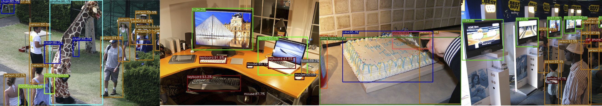

<div align="center"></div>


## Introduction
YOLOX is an anchor-free version of YOLO, with a simpler design but better performance! It aims to bridge the gap between research and industrial communities.
For more details, please refer to our [report on Arxiv](https://arxiv.org/abs/2107.08430).

This repo is an implementation of PyTorch version YOLOX, there is also a [MegEngine implementation](https://github.com/MegEngine/YOLOX).


## Updates!!
* 【2023/02/28】 We support assignment visualization tool, see doc [here](./docs/assignment_visualization.md).
* 【2022/04/14】 We support jit compile op.
* 【2021/08/19】 We optimize the training process with **2x** faster training and **~1%** higher performance! See [notes](docs/updates_note.md) for more details.
* 【2021/08/05】 We release [MegEngine version YOLOX](https://github.com/MegEngine/YOLOX).
* 【2021/07/28】 We fix the fatal error of [memory leak](https://github.com/Megvii-BaseDetection/YOLOX/issues/103)
* 【2021/07/26】 We now support [MegEngine](https://github.com/Megvii-BaseDetection/YOLOX/tree/main/demo/MegEngine) deployment.
* 【2021/07/20】 We have released our technical report on [Arxiv](https://arxiv.org/abs/2107.08430).

## Benchmark

#### Standard Models.

|Model |size |mAP<sup>val<br>0.5:0.95 |mAP<sup>test<br>0.5:0.95 | Speed V100<br>(ms) | Params<br>(M) |FLOPs<br>(G)| weights |
| ------        |:---: | :---:    | :---:       |:---:     |:---:  | :---: | :----: |
|[YOLOX-s](./exps/default/yolox_s.py)    |640  |40.5 |40.5      |9.8      |9.0 | 26.8 | [github](https://github.com/Megvii-BaseDetection/YOLOX/releases/download/0.1.1rc0/yolox_s.pth) |
|[YOLOX-m](./exps/default/yolox_m.py)    |640  |46.9 |47.2      |12.3     |25.3 |73.8| [github](https://github.com/Megvii-BaseDetection/YOLOX/releases/download/0.1.1rc0/yolox_m.pth) |
|[YOLOX-l](./exps/default/yolox_l.py)    |640  |49.7 |50.1      |14.5     |54.2| 155.6 | [github](https://github.com/Megvii-BaseDetection/YOLOX/releases/download/0.1.1rc0/yolox_l.pth) |
|[YOLOX-x](./exps/default/yolox_x.py)   |640   |51.1 |**51.5**  | 17.3    |99.1 |281.9 | [github](https://github.com/Megvii-BaseDetection/YOLOX/releases/download/0.1.1rc0/yolox_x.pth) |
|[YOLOX-Darknet53](./exps/default/yolov3.py)   |640  | 47.7 | 48.0 | 11.1 |63.7 | 185.3 | [github](https://github.com/Megvii-BaseDetection/YOLOX/releases/download/0.1.1rc0/yolox_darknet.pth) |

<details>
<summary>Legacy models</summary>

|Model |size |mAP<sup>test<br>0.5:0.95 | Speed V100<br>(ms) | Params<br>(M) |FLOPs<br>(G)| weights |
| ------        |:---: | :---:       |:---:     |:---:  | :---: | :----: |
|[YOLOX-s](./exps/default/yolox_s.py)    |640  |39.6      |9.8     |9.0 | 26.8 | [onedrive](https://megvii-my.sharepoint.cn/:u:/g/personal/gezheng_megvii_com/EW62gmO2vnNNs5npxjzunVwB9p307qqygaCkXdTO88BLUg?e=NMTQYw)/[github](https://github.com/Megvii-BaseDetection/storage/releases/download/0.0.1/yolox_s.pth) |
|[YOLOX-m](./exps/default/yolox_m.py)    |640  |46.4      |12.3     |25.3 |73.8| [onedrive](https://megvii-my.sharepoint.cn/:u:/g/personal/gezheng_megvii_com/ERMTP7VFqrVBrXKMU7Vl4TcBQs0SUeCT7kvc-JdIbej4tQ?e=1MDo9y)/[github](https://github.com/Megvii-BaseDetection/storage/releases/download/0.0.1/yolox_m.pth) |
|[YOLOX-l](./exps/default/yolox_l.py)    |640  |50.0  |14.5 |54.2| 155.6 | [onedrive](https://megvii-my.sharepoint.cn/:u:/g/personal/gezheng_megvii_com/EWA8w_IEOzBKvuueBqfaZh0BeoG5sVzR-XYbOJO4YlOkRw?e=wHWOBE)/[github](https://github.com/Megvii-BaseDetection/storage/releases/download/0.0.1/yolox_l.pth) |
|[YOLOX-x](./exps/default/yolox_x.py)   |640  |**51.2**      | 17.3 |99.1 |281.9 | [onedrive](https://megvii-my.sharepoint.cn/:u:/g/personal/gezheng_megvii_com/EdgVPHBziOVBtGAXHfeHI5kBza0q9yyueMGdT0wXZfI1rQ?e=tABO5u)/[github](https://github.com/Megvii-BaseDetection/storage/releases/download/0.0.1/yolox_x.pth) |
|[YOLOX-Darknet53](./exps/default/yolov3.py)   |640  | 47.4      | 11.1 |63.7 | 185.3 | [onedrive](https://megvii-my.sharepoint.cn/:u:/g/personal/gezheng_megvii_com/EZ-MV1r_fMFPkPrNjvbJEMoBLOLAnXH-XKEB77w8LhXL6Q?e=mf6wOc)/[github](https://github.com/Megvii-BaseDetection/storage/releases/download/0.0.1/yolox_darknet53.pth) |

</details>

#### Light Models.

|Model |size |mAP<sup>val<br>0.5:0.95 | Params<br>(M) |FLOPs<br>(G)| weights |
| ------        |:---:  |  :---:       |:---:     |:---:  | :---: |
|[YOLOX-Nano](./exps/default/yolox_nano.py) |416  |25.8  | 0.91 |1.08 | [github](https://github.com/Megvii-BaseDetection/YOLOX/releases/download/0.1.1rc0/yolox_nano.pth) |
|[YOLOX-Tiny](./exps/default/yolox_tiny.py) |416  |32.8 | 5.06 |6.45 | [github](https://github.com/Megvii-BaseDetection/YOLOX/releases/download/0.1.1rc0/yolox_tiny.pth) |


<details>
<summary>Legacy models</summary>

|Model |size |mAP<sup>val<br>0.5:0.95 | Params<br>(M) |FLOPs<br>(G)| weights |
| ------        |:---:  |  :---:       |:---:     |:---:  | :---: |
|[YOLOX-Nano](./exps/default/yolox_nano.py) |416  |25.3  | 0.91 |1.08 | [github](https://github.com/Megvii-BaseDetection/storage/releases/download/0.0.1/yolox_nano.pth) |
|[YOLOX-Tiny](./exps/default/yolox_tiny.py) |416  |32.8 | 5.06 |6.45 | [github](https://github.com/Megvii-BaseDetection/storage/releases/download/0.0.1/yolox_tiny_32dot8.pth) |

</details>

## Quick Start

<details>
<summary>Installation</summary>

Step1. Install YOLOX from source.
```shell
git clone git@github.com:Megvii-BaseDetection/YOLOX.git
cd YOLOX
pip3 install -v -e .  # or  python3 setup.py develop
```

</details>

<details>
<summary>Demo</summary>

Step1. Download a pretrained model from the benchmark table.

Step2. Use either -n or -f to specify your detector's config. For example:

```shell
python tools/demo.py image -n yolox-s -c /path/to/your/yolox_s.pth --path assets/dog.jpg --conf 0.25 --nms 0.45 --tsize 640 --save_result --device [cpu/gpu]
```
or
```shell
python tools/demo.py image -f exps/default/yolox_s.py -c /path/to/your/yolox_s.pth --path assets/dog.jpg --conf 0.25 --nms 0.45 --tsize 640 --save_result --device [cpu/gpu]
```
Demo for video:
```shell
python tools/demo.py video -n yolox-s -c /path/to/your/yolox_s.pth --path /path/to/your/video --conf 0.25 --nms 0.45 --tsize 640 --save_result --device [cpu/gpu]
```


</details>

<details>
<summary>Reproduce our results on COCO</summary>

Step1. Prepare COCO dataset
```shell
cd <YOLOX_HOME>
ln -s /path/to/your/COCO ./datasets/COCO
```

Step2. Reproduce our results on COCO by specifying -n:

```shell
python -m yolox.tools.train -n yolox-s -d 8 -b 64 --fp16 -o [--cache]
                               yolox-m
                               yolox-l
                               yolox-x
```
* -d: number of gpu devices
* -b: total batch size, the recommended number for -b is num-gpu * 8
* --fp16: mixed precision training
* --cache: caching imgs into RAM to accelarate training, which need large system RAM.


When using -f, the above commands are equivalent to:
```shell
python -m yolox.tools.train -f exps/default/yolox_s.py -d 8 -b 64 --fp16 -o [--cache]
                               exps/default/yolox_m.py
                               exps/default/yolox_l.py
                               exps/default/yolox_x.py
```

**Multi Machine Training**

We also support multi-nodes training. Just add the following args:
* --num\_machines: num of your total training nodes
* --machine\_rank: specify the rank of each node

Suppose you want to train YOLOX on 2 machines, and your master machines's IP is 123.123.123.123, use port 12312 and TCP.

On master machine, run
```shell
python tools/train.py -n yolox-s -b 128 --dist-url tcp://123.123.123.123:12312 --num_machines 2 --machine_rank 0
```
On the second machine, run
```shell
python tools/train.py -n yolox-s -b 128 --dist-url tcp://123.123.123.123:12312 --num_machines 2 --machine_rank 1
```

**Logging to Weights & Biases**

To log metrics, predictions and model checkpoints to [W&B](https://docs.wandb.ai/guides/integrations/other/yolox) use the command line argument `--logger wandb` and use the prefix "wandb-" to specify arguments for initializing the wandb run.

```shell
python tools/train.py -n yolox-s -d 8 -b 64 --fp16 -o [--cache] --logger wandb wandb-project <project name>
                         yolox-m
                         yolox-l
                         yolox-x
```

An example wandb dashboard is available [here](https://wandb.ai/manan-goel/yolox-nano/runs/3pzfeom0)

**Others**

See more information with the following command:
```shell
python -m yolox.tools.train --help
```

</details>


<details>
<summary>Evaluation</summary>

We support batch testing for fast evaluation:

```shell
python -m yolox.tools.eval -n  yolox-s -c yolox_s.pth -b 64 -d 8 --conf 0.001 [--fp16] [--fuse]
                               yolox-m
                               yolox-l
                               yolox-x
```
* --fuse: fuse conv and bn
* -d: number of GPUs used for evaluation. DEFAULT: All GPUs available will be used.
* -b: total batch size across on all GPUs

To reproduce speed test, we use the following command:
```shell
python -m yolox.tools.eval -n  yolox-s -c yolox_s.pth -b 1 -d 1 --conf 0.001 --fp16 --fuse
                               yolox-m
                               yolox-l
                               yolox-x
```

</details>


<details>
<summary>Tutorials</summary>

*  [Training on custom data](docs/train_custom_data.md)
*  [Caching for custom data](docs/cache.md)
*  [Manipulating training image size](docs/manipulate_training_image_size.md)
*  [Assignment visualization](docs/assignment_visualization.md)
*  [Freezing model](docs/freeze_module.md)

</details>

## Deployment


1. [MegEngine in C++ and Python](./demo/MegEngine)
2. [ONNX export and an ONNXRuntime](./demo/ONNXRuntime)
3. [TensorRT in C++ and Python](./demo/TensorRT)
4. [ncnn in C++ and Java](./demo/ncnn)
5. [OpenVINO in C++ and Python](./demo/OpenVINO)
6. [Accelerate YOLOX inference with nebullvm in Python](./demo/nebullvm)

## Third-party resources
* YOLOX for streaming perception: [StreamYOLO (CVPR 2022 Oral)](https://github.com/yancie-yjr/StreamYOLO)
* The YOLOX-s and YOLOX-nano are Integrated into [ModelScope](https://www.modelscope.cn/home). Try out the Online Demo at [YOLOX-s](https://www.modelscope.cn/models/damo/cv_cspnet_image-object-detection_yolox/summary) and [YOLOX-Nano](https://www.modelscope.cn/models/damo/cv_cspnet_image-object-detection_yolox_nano_coco/summary) respectively 🚀.
* Integrated into [Huggingface Spaces 🤗](https://huggingface.co/spaces) using [Gradio](https://github.com/gradio-app/gradio). Try out the Web Demo: [](https://huggingface.co/spaces/Sultannn/YOLOX-Demo)
* The ncnn android app with video support: [ncnn-android-yolox](https://github.com/FeiGeChuanShu/ncnn-android-yolox) from [FeiGeChuanShu](https://github.com/FeiGeChuanShu)
* YOLOX with Tengine support: [Tengine](https://github.com/OAID/Tengine/blob/tengine-lite/examples/tm_yolox.cpp) from [BUG1989](https://github.com/BUG1989)
* YOLOX + ROS2 Foxy: [YOLOX-ROS](https://github.com/Ar-Ray-code/YOLOX-ROS) from [Ar-Ray](https://github.com/Ar-Ray-code)
* YOLOX Deploy DeepStream: [YOLOX-deepstream](https://github.com/nanmi/YOLOX-deepstream) from [nanmi](https://github.com/nanmi)
* YOLOX MNN/TNN/ONNXRuntime: [YOLOX-MNN](https://github.com/DefTruth/lite.ai.toolkit/blob/main/lite/mnn/cv/mnn_yolox.cpp)、[YOLOX-TNN](https://github.com/DefTruth/lite.ai.toolkit/blob/main/lite/tnn/cv/tnn_yolox.cpp) and [YOLOX-ONNXRuntime C++](https://github.com/DefTruth/lite.ai.toolkit/blob/main/lite/ort/cv/yolox.cpp) from [DefTruth](https://github.com/DefTruth)
* Converting darknet or yolov5 datasets to COCO format for YOLOX: [YOLO2COCO](https://github.com/RapidAI/YOLO2COCO) from [Daniel](https://github.com/znsoftm)

## Cite YOLOX
If you use YOLOX in your research, please cite our work by using the following BibTeX entry:

```latex
 @article{yolox2021,
  title={YOLOX: Exceeding YOLO Series in 2021},
  author={Ge, Zheng and Liu, Songtao and Wang, Feng and Li, Zeming and Sun, Jian},
  journal={arXiv preprint arXiv:2107.08430},
  year={2021}
}
```
## In memory of Dr. Jian Sun
Without the guidance of [Dr. Jian Sun](https://scholar.google.com/citations?user=ALVSZAYAAAAJ), YOLOX would not have been released and open sourced to the community.
The passing away of Dr. Sun is a huge loss to the Computer Vision field. We add this section here to express our remembrance and condolences to our captain Dr. Sun.
It is hoped that every AI practitioner in the world will stick to the belief of "continuous innovation to expand cognitive boundaries, and extraordinary technology to achieve product value" and move forward all the way.

<div align="center"></div>
没有孙剑博士的指导，YOLOX也不会问世并开源给社区使用。
孙剑博士的离去是CV领域的一大损失，我们在此特别添加了这个部分来表达对我们的“船长”孙老师的纪念和哀思。
希望世界上的每个AI从业者秉持着“持续创新拓展认知边界，非凡科技成就产品价值”的观念，一路向前。
