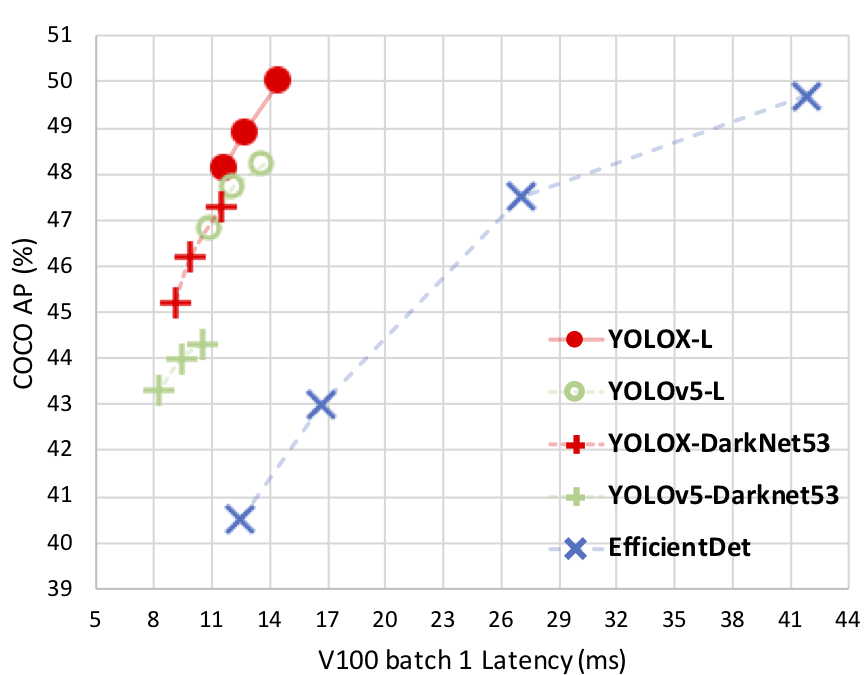
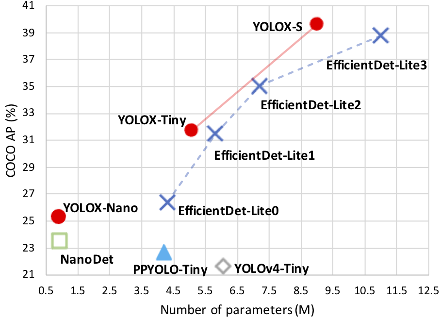

<div align="center"></div>


## <div align="center">Introduction</div>
YOLOX is an anchor-free version of YOLO, with a simpler design but better performance! It aims to bridge the gap between research and industrial communities.


## <div align="center">Why YOLOX?</div>

<div align="center"></div>

## <div align="center">News!!</div>
* 【2020/07/19】 We have released our technical report on [Arxiv](xxx)!!

## <div align="center">Benchmark</div>

### Standard Models.
|Model |size |mAP<sup>test<br>0.5:0.95 | Speed V100<br>(ms) | Params<br>(M) |FLOPs<br>(B)| weights |
| ------        |:---: | :---:       |:---:     |:---:  | :---: | :----: |
|[YOLOX-s]()    |640  |39.6      |9.8     |9.0 | 26.8 | - |
|[YOLOX-m]()    |640  |46.4      |12.3     |25.3 |73.8| - |
|[YOLOX-l]()    |640  |50.0  |14.5 |54.2| 155.6 | - |
|[YOLOX-x]()   |640  |**51.2**      | 17.3 |99.1 |281.9 | - |

### Light Models.
|Model |size |mAP<sup>val<br>0.5:0.95 |  Speed V100<br>(ms) | Params<br>(M) |FLOPs<br>(B)| weights |
| ------        |:---:  |  :---:       |:---:     |:---:  | :---: | :----: |
|[YOLOX-Nano]() |416  |25.3  |- | 0.91 |1.08 | - |
|[YOLOX-Tiny]() |416  |31.7  |- | 5.06 |6.45 | - |

## <div align="center">Quick Start</div>

### Installation

Step1. Install [apex](https://github.com/NVIDIA/apex).

```shell
git clone https://github.com/NVIDIA/apex
cd apex
pip3 install -v --disable-pip-version-check --no-cache-dir --global-option="--cpp_ext" --global-option="--cuda_ext" ./
```
Step2. Install YOLOX.
```bash
$ git clone git@github.com:Megvii-BaseDetection/YOLOX.git
$ cd yolox
$ pip3 install -v -e .  # or "python3 setup.py develop
```

### Demo

You can use either -n or -f to specify your detector's config:

```shell
python tools/demo.py -n yolox-s -c <MODEL_PATH> --conf 0.3 --nms 0.65 --tsize 640
```
or
```shell
python tools/demo.py -f exps/base/yolox_s.py -c <MODEL_PATH> --conf 0.3 --nms 0.65 --tsize 640
```


<details open>
<summary>Reproduce our results on COCO</summary>

Step1. 

* Reproduce our results on COCO by specifying -n:

```shell
python tools/train.py -n yolox-s -d 8 -b 64 --fp16 -o
                         yolox-m
                         yolox-l
                         yolox-x
```
Notes:
* -d: number of gpu devices
* -b: total batch size, the recommended number for -b equals to num_gpu * 8
* --fp16: mixed precision training

The above commands are equivalent to:

```shell
python tools/train.py -f exps/base/yolox-s.py -d 8 -b 64 --fp16 -o
                         exps/base/yolox-m.py
                         exps/base/yolox-l.py
                         exps/base/yolox-x.py
```

* Customize your training.

* Finetune your datset on COCO pretrained models.
</details>

<details open>
<summary>Evaluation</summary>
We support batch testing for fast evaluation:

```shell
python tools/eval.py -n  yolox-s -b 64 --conf 0.001 --fp16 (optional) --fuse (optional) --test (for test-dev set) 
                         yolox-m
                         yolox-l
                         yolox-x
```

To reproduce speed test, we use the following command:
```shell
python tools/eval.py -n  yolox-s -b 1 -d 0 --conf 0.001 --fp16 --fuse --test (for test-dev set) 
                         yolox-m
                         yolox-l
                         yolox-x
```

## <div align="center">Deployment</div>

</details>

1.  [ONNX: Including ONNX export and an ONNXRuntime demo.]()
2.  [TensorRT in both C++ and Python]()
3.  [NCNN in C++]()
4.  [OpenVINO in both C++ and Python]()

## <div align="center">Cite Our Work</div>


If you find this project useful for you, please use the following BibTeX entry.

TODO
