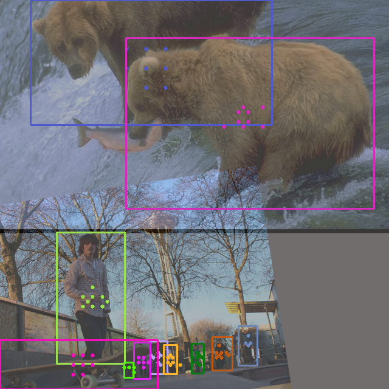

# Visualize label assignment

This tutorial explains how to visualize your label asssignment result when training with YOLOX.

## 1. Visualization command

We provide a visualization tool to help you visualize your label assignment result. You can find it in [`tools/visualize_assignment.py`](../tools/visualize_assign.py).

Here is an example of command to visualize your label assignment result:

```shell
python3 tools/visualize_assign.py -f /path/to/your/exp.py yolox-s -d 1 -b 8 --max-batch 2
```

`max-batch` here means the maximum number of batches to visualize. The default value is 1, which the tool means only visualize the first batch.

By the way, the mosaic augmentation is used in default dataloader, so you can also see the mosaic result here.

After running the command, the logger will show you where the visualization result is saved, let's open it and into the step 2.

## 2. Check the visualization result

Here is an example of visualization result:
<div align="center"></div>

Those dots in one box is the matched anchor of gt box. **The color of dots is the same as the color of the box** to help you determine which object is assigned to the anchor. Note the box and dots are **instance level** visualization, which means the same class may have different colors.  
**If the gt box doesn't match any anchor, the box will be marked as red and the red text "unmatched" will be drawn over the box**.

Please feel free to open an issue if you have any questions.
